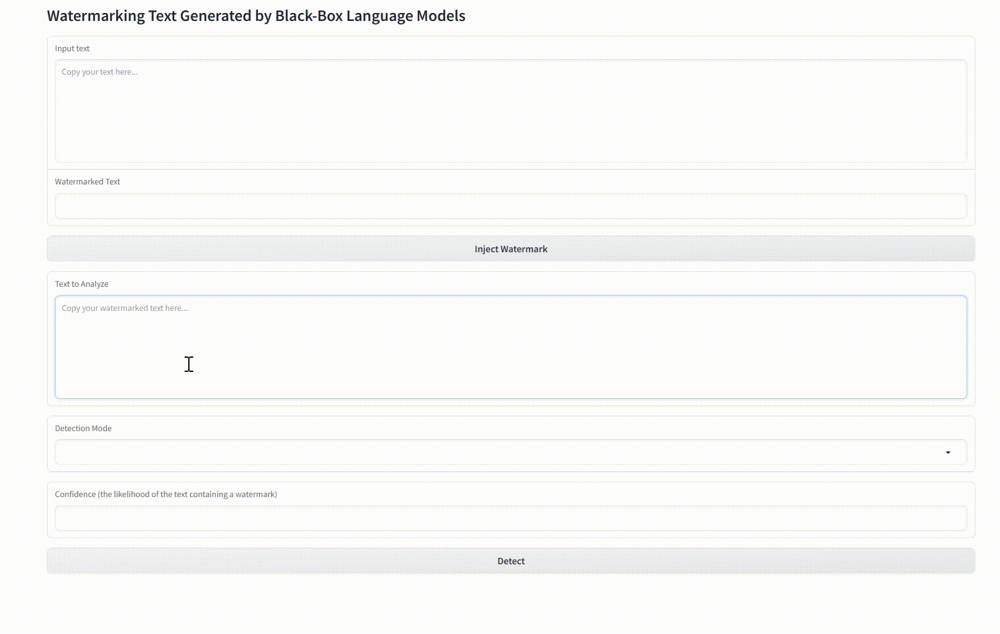

# [Watermarking Text Generated by Black-Box Language Models](https://arxiv.org/abs/2301.10226)

### [Demo](https://huggingface.co/spaces/tomg-group-umd/lm-watermarking) | [Paper](https://arxiv.org/abs/2301.10226)

Official implementation of the watermark injection and detection algorithms presented in the paper:

"Watermarking Text Generated by Black-Box Language Models" by _Xi Yang, Kejiang Chen, Weiming Zhang, Chang Liu, Yuang Qi, Jie Zhang, Han Fang, Nenghai Yu_.  

### Requirements
- Python 3.9
- check requirements.txt
```
pip install -r requirements.txt
```
- For Chinese, please download the [pre-trained Chinese word vectors](https://drive.google.com/file/d/1Zh9ZCEu8_eSQ-qkYVQufQDNKPC4mtEKR/view) and place it in the root directory.

### Repo contents

The watermark injection and detection modules are located in the `models` directory. `watermark_original.py` implements the iterative algorithms as described in the paper. `watermark_faster.py` introduces batch processing to speed up the watermark injection algorithm and the precise detection algorithm.

We provide two demonstrations, `demo_CLI.py` and `demo_gradio.py`, which correspond to command-line interaction and graphical interface interaction respectively.

### Demo Usage
#### CLI
```sh
$ python demo_CLI.py --language English --tau_word 0.8 --lamda 0.83
```
<p align="center">
  
</p>

```sh
$ python demo_CLI.py --language Chinese --tau_word 0.75 --lamda 0.83
```

<p align="center">
  
</p>

#### Gradio
```sh
$ python demo_gradio.py --language English --tau_word 0.8 --lamda 0.83
```
<p align="center">
  
</p>

```sh
$ python demo_gradio.py --language Chinese --tau_word 0.75 --lamda 0.83
```
<p align="center">
  
</p>
